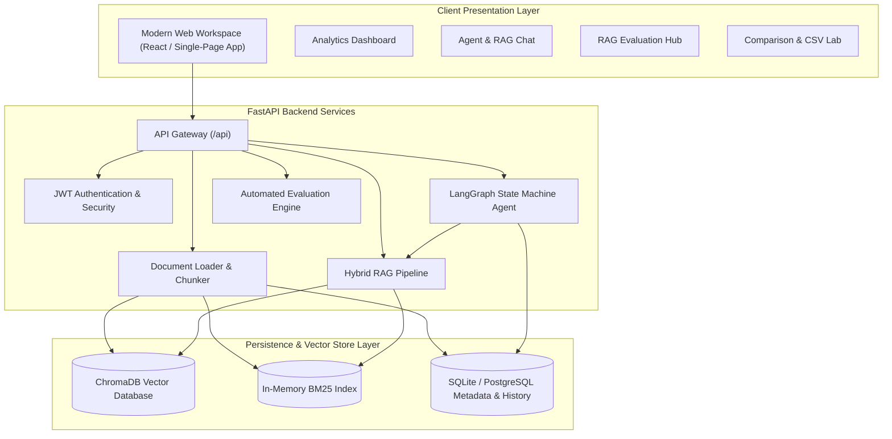
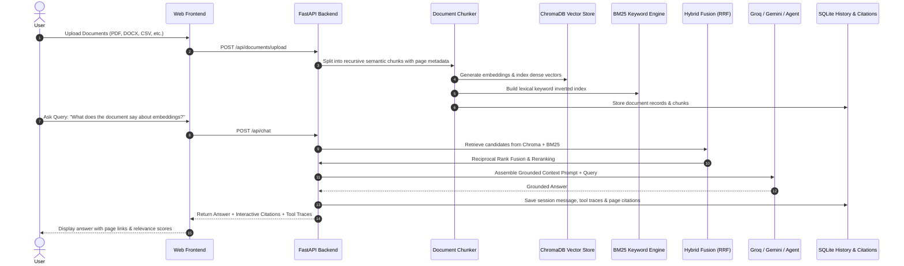

# Multi-Document AI Knowledge Agent
> **Production-Ready Enterprise GenAI & RAG Platform** powered by LangChain, LangGraph, ChromaDB, Hybrid Search (Vector + BM25), Reciprocal Rank Fusion, and Grounded Source Citations.

---

## 🌟 Executive Overview
The **Multi-Document AI Knowledge Agent** is an enterprise-grade Generative AI platform designed to transform multi-format document repositories into private, strictly grounded, searchable knowledge bases. Unlike basic chatbot prototypes, this application implements full **Hybrid Retrieval-Augmented Generation (RAG)** as its foundational core, integrated with an autonomous **LangGraph AI Agent** equipped with specialized tools for cross-document reasoning, safe tabular CSV analytics, conversational memory, and automated RAG evaluation benchmarks.



---

## 🚀 Key Highlights & Capabilities

| Capability | Implementation Details |
|---|---|
| **Multi-Format Ingestion** | Native extraction for **PDF, DOCX, TXT, CSV, and Markdown** with page-level tracking. |
| **Hybrid Retrieval** | Combines **Dense Vector Semantic Search** (384-dim embeddings) and **Sparse Lexical Search** (BM25) via **Reciprocal Rank Fusion (RRF)**. |
| **Autonomous AI Agent** | **LangGraph** tool-calling workflow with deterministic intent routing and multi-step reasoning. |
| **Strict Grounding & Hallucination Guardrails** | Rejects ungrounded extrapolation; every factual claim is backed by exact document and page citations. |
| **Multi-Document Reasoning** | Side-by-side comparative analysis (e.g. `Resume.pdf` vs `Job_Description.pdf` skill gap analysis). |
| **Safe CSV Data Analytics** | Deterministic numeric calculations via **Pandas** (averages, sums, groupings, top-N) preventing LLM arithmetic errors. |
| **Conversational Memory** | SQLite-backed session persistence with semantic context retrieval without context window bloat. |
| **Production RAG Evaluation Hub** | Automated benchmarking measuring **Retrieval Precision, Recall, Context Relevance, Answer Faithfulness, Correctness, and Citation Accuracy**. |

---

## 🛠️ Core RAG Pipeline Architecture



---

## 🤖 AI Agent & Tool Ecosystem

The agent uses a **LangGraph** state machine to dynamically select and execute appropriate tools:

1. **RAG Search Tool (`rag_search_tool`)**: Searches private knowledge base chunks with hybrid search and returns grounded snippets with page numbers.
2. **Document Summary Tool (`document_summary_tool`)**: Summarizes the structure, key topics, and sections of selected files.
3. **Multi-Document Comparison Tool (`document_comparison_tool`)**: Extracts parallel chunks across two documents (e.g., candidate resume vs employer job description) to highlight alignments and missing gaps.
4. **CSV Analytics Tool (`csv_analysis_tool`)**: Executes deterministic Pandas aggregations (mean, median, sum, highest record, category group by).
5. **Calculator Tool (`calculator_tool`)**: Safely evaluates mathematical equations and percentages.
6. **Metadata Tool (`metadata_search_tool`)**: Queries catalog information, file formats, and page counts.
7. **Conversation Memory Tool (`conversation_memory_tool`)**: Recalls earlier conversational context and user queries.

---

## 📊 RAG Evaluation Framework

The system includes a dedicated evaluation benchmark suite evaluating 7 metrics:

- **Retrieval Precision**: Fraction of retrieved chunks matching the target ground-truth document.
- **Retrieval Recall**: Verification that the target ground-truth document and page were retrieved.
- **Context Relevance**: Semantic similarity and relevance score of retrieved passages.
- **Answer Faithfulness**: Strict grounding verification to ensure zero hallucinations.
- **Answer Correctness**: Semantic agreement with ground-truth reference answers.
- **Citation Accuracy**: Validates whether citations accurately point to the exact document and page.
- **Query Latency**: End-to-end execution runtime in milliseconds.

---

## 📂 Project Structure

```
Multi-Document AI Agent/
├── backend/
│   ├── app/
│   │   ├── config/              # Environment settings & configuration
│   │   │   └── settings.py
│   │   ├── models/              # Pydantic schemas & SQLAlchemy DB models
│   │   │   ├── schemas.py
│   │   │   └── db_models.py
│   │   ├── embeddings/          # SentenceTransformers & Cloud embeddings
│   │   │   └── embedding_service.py
│   │   ├── retrievers/          # ChromaDB, BM25, Hybrid RRF, and Reranker
│   │   │   ├── vector_store.py
│   │   │   ├── bm25_retriever.py
│   │   │   ├── hybrid_retriever.py
│   │   │   └── reranker.py
│   │   ├── rag/                 # Loaders, Chunker, Citation engine, RAG Chain
│   │   │   ├── document_loader.py
│   │   │   ├── chunker.py
│   │   │   ├── citation.py
│   │   │   └── rag_chain.py
│   │   ├── tools/               # Specialized agent tools (RAG, CSV, Calc, Memory)
│   │   │   ├── rag_tools.py
│   │   │   ├── csv_tool.py
│   │   │   ├── calc_tool.py
│   │   │   └── memory_tool.py
│   │   ├── memory/              # SQLite session memory manager
│   │   │   └── memory_service.py
│   │   ├── agents/              # LangGraph AI Knowledge Agent workflow
│   │   │   └── knowledge_agent.py
│   │   ├── evaluation/          # Benchmark dataset runner & metrics engine
│   │   │   └── evaluation_service.py
│   │   ├── services/            # Demo sample document generator
│   │   │   └── sample_generator.py
│   │   └── api/                 # FastAPI routers
│   │       ├── routes/
│   │       │   ├── auth.py
│   │       │   ├── documents.py
│   │       │   ├── chat.py
│   │       │   ├── search.py
│   │       │   ├── tools.py
│   │       │   ├── evaluation.py
│   │       │   └── system.py
│   │       └── __init__.py
├── frontend/                    # Modern responsive React / HTML5 UI
│   ├── index.html
│   ├── style.css
│   └── app.js
├── data/
│   ├── uploads/                 # Uploaded files
│   ├── sample_documents/        # Pre-generated demo PDFs and CSV
│   └── chroma_db/               # Persistent ChromaDB vector store
├── evaluation/
│   ├── datasets/                # benchmark_qa.json
│   └── results/                 # Persisted evaluation reports
├── tests/                       # Automated unit & integration tests
│   ├── test_document_loader.py
│   ├── test_tools.py
│   └── test_agent_and_rag.py
├── main.py                      # FastAPI server entry point
├── run.py                       # Quick application launcher
├── requirements.txt             # Python dependencies
└── README.md                    # Project documentation
```

---

## ⚡ Quick Start & Installation

### 1. Clone or Open the Repository
```bash
cd "Multi-Document AI Agent"
```

### 2. Install Dependencies
```bash
pip install -r requirements.txt
```

### 3. Configure Environment Variables (Optional)
Create a `.env` file in the root directory:
```env
# Optional Cloud LLM Keys (Default fallback offline engine works without keys)
GROQ_API_KEY=gsk_your_groq_api_key
DEFAULT_LLM_PROVIDER=groq
GROQ_MODEL=llama-3.3-70b-versatile

# Or Google Gemini
GEMINI_API_KEY=AIza_your_gemini_api_key
GEMINI_MODEL=gemini-1.5-flash

# Security Secret Key
SECRET_KEY=production-secret-key-2026
```

### 4. Launch the Server & UI
```bash
python main.py
```
Open your browser and navigate to:
```
http://localhost:8000
```

---

## 🧪 Interactive Demo Scenarios

The platform includes **1-click pre-generated sample files**:
1. `Resume.pdf` (Senior AI/GenAI Engineer profile)
2. `Job_Description.pdf` (Apex AI Labs Staff GenAI role)
3. `RAG_Notes.pdf` (Technical guide on Chunking, Embeddings, Vector DBs, Hybrid Search)
4. `ML_Notes.pdf` (Transformers, Self-Attention, PEFT, LoRA)
5. `Sample_Sales.csv` (Quarterly enterprise software sales dataset)

### Demo Queries to Test:
| Scenario | User Query | Expected Behavior & Tool |
|---|---|---|
| **1. Grounded RAG Query** | *"Explain RAG from my uploaded notes."* | Invokes `rag_search_tool`, retrieves from `RAG_Notes.pdf`, outputs grounded answer with Page 1 citation. |
| **2. Multi-Doc Gap Analysis** | *"Compare my resume with the job description and identify missing skills."* | Invokes `document_comparison_tool`, cross-references both documents, identifies skill matches and gaps (e.g. GraphRAG, Neo4j). |
| **3. CSV Numeric Analytics** | *"What is the average sales and highest selling product?"* | Invokes `csv_analysis_tool`, executes safe Pandas calculation, outputs exact numbers without LLM arithmetic errors. |
| **4. Hybrid Search Lookup** | *"Find the section that discusses embeddings and vector databases."* | Performs Dense Vector + BM25 Keyword fusion search with score breakdown. |
| **5. Mathematical Calculation** | *"Calculate 52500 * 1.15 to project 15% revenue increase."* | Invokes `calculator_tool`, safely computes exact mathematical result. |
| **6. Conversation Memory** | *"What did we discuss earlier about RAG?"* | Invokes `conversation_memory_tool`, retrieves previous session messages. |
| **7. Live Evaluation** | Click *"Run Live Benchmark Evaluation"* in Evaluation tab | Runs automated test suite, computes precision/recall/faithfulness radar scores. |

---

## 🔒 Security & Best Practices
- **Strict Grounding**: Zero fact hallucination on private data queries.
- **Safe Tabular Execution**: Controlled Pandas dataframe operations without arbitrary code execution.
- **Input Validation**: Strict file type validation (`.pdf`, `.docx`, `.txt`, `.csv`, `.md`) and size limits.
- **Secure Password Hashing**: Passlib + bcrypt password encryption with JWT session tokens.
- **Privacy First**: Sensitive API keys and document vectors remain safely in local/private boundaries.

---

## 📄 License
MIT License. Built for enterprise GenAI applications and engineering portfolios.
